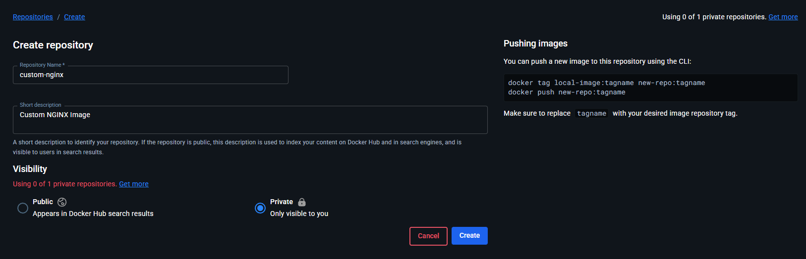
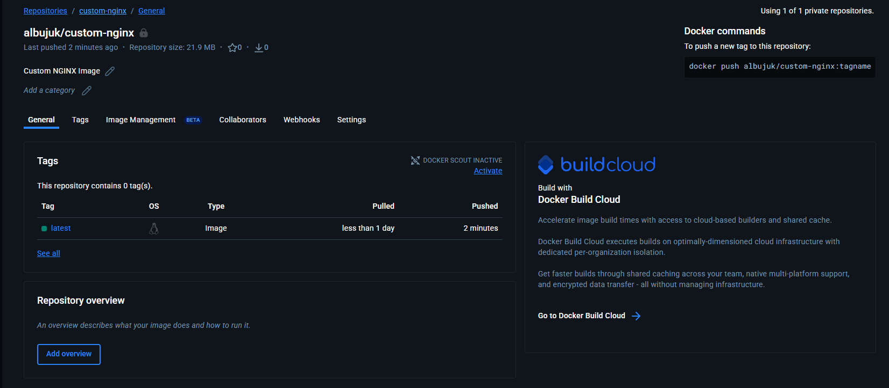

# custom-nginx-container-image-task

In this task I've built a custom image with `nginx:1.29.4-alpine` as the base image.

## Files:
- Dockerfile: Contains the instructions for docker to build the image.
- index.html: A simple html page to be rendered showing that the configuration is genuine.
- custom.conf: Custom NGINX configurations.

in the repo directory run the following command:

```sh
docker build . -t albujuk/custom-nginx
```
This Command builds the image making it usable locally.

Create a private docker repo:


Then run the following command to push the image to the private repo

```sh
docker push albujuk/custom-nginx:latest
```




now the image is hosted in a private DockerHub registry.

